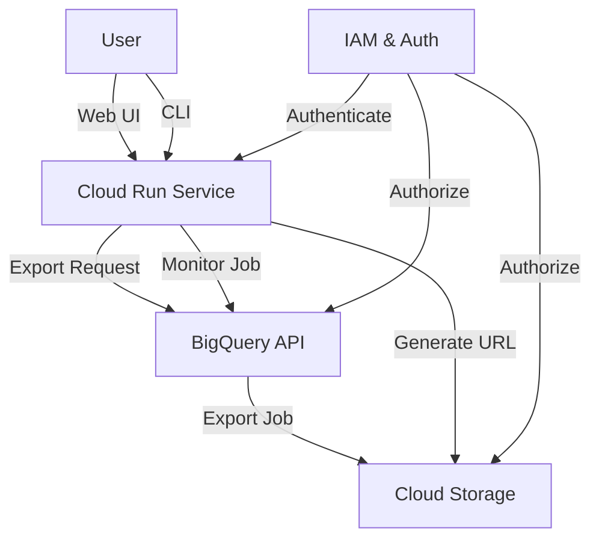

# Architecture Documentation

## System Architecture

The BigQuery Table Export Utility implements a modern, cloud-native architecture leveraging several Google Cloud Platform services. This document provides a detailed overview of the system components and their interactions.

## Component Details

### 1. Frontend Interfaces

#### Web UI
- React-based single-page application
- Material-UI components for modern design
- Real-time progress updates using Server-Sent Events
- Responsive layout for desktop and mobile

#### CLI Tool
- Interactive command-line interface using Click
- Rich terminal UI with progress bars
- Automatic credential management
- Error handling and retry logic

### 2. Backend Service (Cloud Run)

#### Core Components
- Flask REST API (v2.3.3)
- Asynchronous job management
- Structured logging
- Error handling and retry mechanisms

#### Key Endpoints
- `/api/v1/datasets` - List available datasets
- `/api/v1/tables` - List tables in a dataset
- `/api/v1/export` - Initiate export operation
- `/api/v1/status` - Check export status
- `/api/v1/download` - Generate download URL

### 3. Google Cloud Integration

#### BigQuery Service
- Table metadata retrieval
- Export job management
- Query execution for data validation
- Job monitoring and status tracking

#### Cloud Storage
- Export file storage
- Automatic file management
- Authenticated URL generation
- Lifecycle management

#### Identity and Access Management
- Native Google Cloud authentication
- Role-based access control
- Resource-level permissions
- Audit logging

## Data Flow

### Export Process
1. User initiates export through UI or CLI
2. Backend validates request and permissions
3. BigQuery export job is created
4. Job progress is monitored
5. Files are stored in Cloud Storage
6. Download URL is generated
7. User downloads files using Google Cloud authentication

### Authentication Flow
1. User authenticates with Google Cloud
2. Credentials are validated by IAM
3. Token is used for API requests
4. Backend verifies permissions
5. Resources are accessed based on IAM roles

## Security Architecture

### Authentication
- Google Cloud native authentication
- Support for organizational SSO
- No stored credentials
- Token-based API access

### Authorization
- Fine-grained IAM roles
- Resource-level permissions
- Least privilege principle
- Regular access reviews

### Data Security
- In-transit encryption
- At-rest encryption
- Authenticated access only
- Audit logging

## Scalability and Performance

### Cloud Run Service
- Automatic scaling based on load
- Container-based deployment
- Resource optimization
- Request-based billing

### BigQuery Integration
- Parallel export processing
- Automatic file splitting
- Optimized query execution
- Job queuing and management

### Storage Management
- Automatic file lifecycle
- Compression support
- Parallel downloads
- Efficient data transfer

## Monitoring and Observability

### Metrics Collection
- Request latency
- Error rates
- Resource utilization
- Export job statistics

### Logging
- Structured log format
- Correlation IDs
- Error tracking
- Audit trails

### Alerting
- Error rate thresholds
- Job failure notifications
- Resource utilization alerts
- Security event monitoring

## Development and Deployment

### CI/CD Pipeline
1. Code commit triggers build
2. Automated testing
3. Container image creation
4. Security scanning
5. Deployment to Cloud Run

### Infrastructure as Code
- Terraform configuration
- Version controlled
- Automated deployment
- Environment consistency

## Best Practices Implementation

### Code Organization
- Modular architecture
- Clean separation of concerns
- Comprehensive documentation
- Type hints and validation

### Error Handling
- Graceful degradation
- Detailed error messages
- Retry mechanisms
- User-friendly notifications

### Testing Strategy
- Unit tests
- Integration tests
- Load testing
- Security testing

## Future Enhancements

### Planned Features
1. Advanced export configuration
2. Custom data transformations
3. Scheduled exports
4. Multi-region support

### Scalability Improvements
1. Caching layer
2. Job queuing system
3. Resource optimization
4. Performance monitoring

## References

- [Cloud Run Documentation](https://cloud.google.com/run/docs)
- [BigQuery Best Practices](https://cloud.google.com/bigquery/docs/best-practices-performance-overview)
- [Cloud Storage Security](https://cloud.google.com/storage/docs/security-best-practices)
- [IAM Best Practices](https://cloud.google.com/iam/docs/best-practices) 